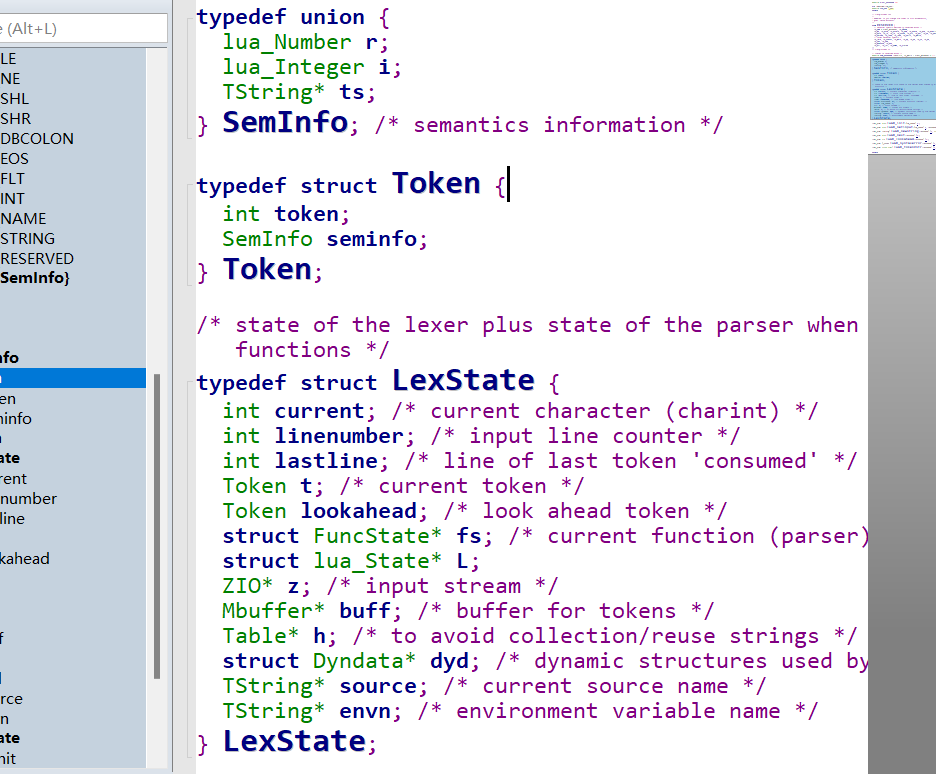

```
这是一个用C++实现简单的Lua解析器，主要帮助理解Lua的语法和语义。(以上分析都是基于Lua 5.3)
```
# 知识了解：

1. **Lua 的语言基础**：在Lua中我们常用到如变量，函数，控制流，表，function等。
2. **解析器的基本原理**：解析器的组成分为，词法分析器，语法分析器，抽象语法树，和解释器。


---
<font color = "red">
这里源码Token里面包含一个tokenId，lua类型，我把这些都放在LuaType.h
</font>



<strong>
为什么需要 Token?
</strong>

1. **解析器需要标记来理解代码结构：** 例如遇到 if 关键字，解析器知道它需要解析一个条件表达式。遇到 = ，解析器知道这是一个赋值操作，Token 提供了语法分析所需的信息。  
2. **分离职责：** 词法分析器只负责将代码拆解成 Token，不处理语法。

---